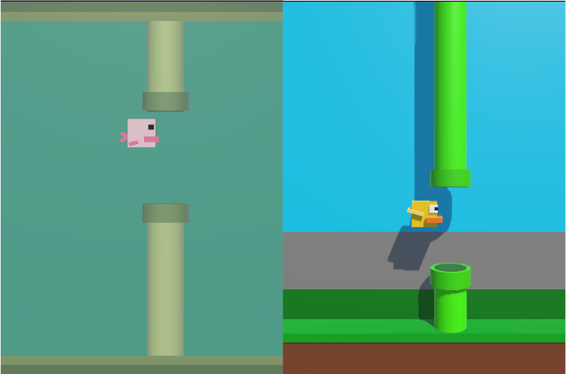

# Blobby Fish (Flappy Bird Copy)

  

## Description

Development of a Flappy Bird game copy with some changes to its aspects and concepts. 
The game is called Blobby Fish and is set in an underwater sewage environment. 
The Unity project contains two scenes: one for the Flappy Bird copy and the other for my main game. 
This is a challenge proposed by Dio as part of a Unity learning track.

## Controls

After you lose, there is a 5-second cooldown to restart the game. 
Although the player's score is not displayed because I haven’t learned how to use the canvas in Unity yet, the game speed increases after 5 points, making it faster. 
To jump, press the space bar.

## Play the Game:

Link: https://play.unity.com/en/games/e55d940b-6d3b-457b-8414-e037cb0e9c05/webgl-builds
